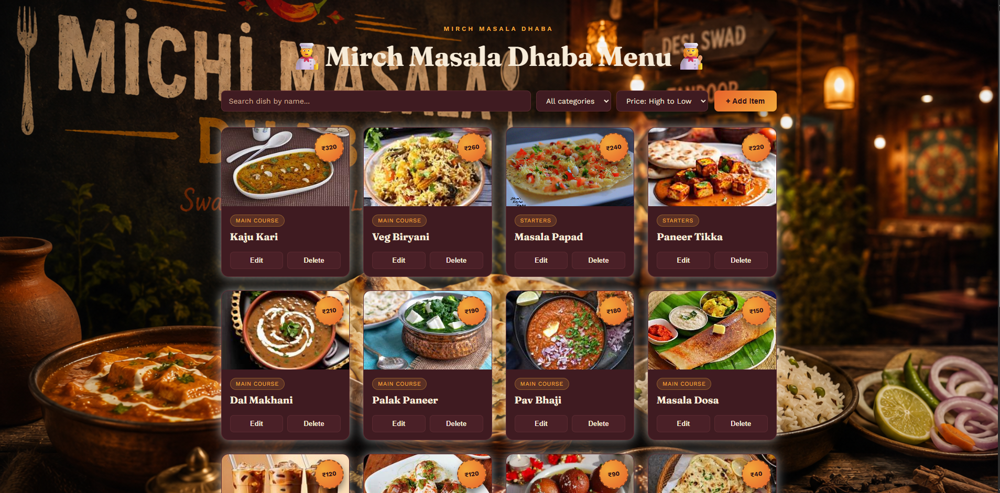
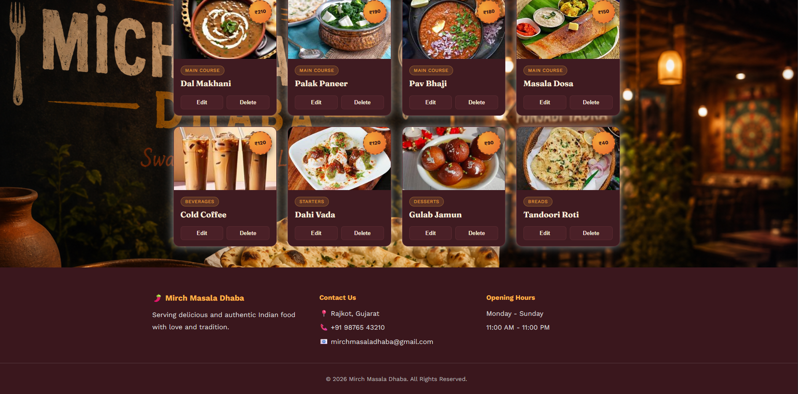

# 🍛 Mirch Masala Dhaba - Menu Management Website

A modern and responsive **Restaurant Menu Management Website** built using **HTML, CSS, and JavaScript**. This project allows restaurant owners to manage their menu by adding, editing, deleting, searching, filtering, and sorting food items in a beautiful user interface.

---

## 📸 Preview



---

## ✨ Features

- 🍽️ Beautiful Restaurant UI
- ➕ Add New Menu Items
- ✏️ Edit Existing Items
- 🗑️ Delete Menu Items
- 🔍 Search Menu by Dish Name
- 📂 Filter Items by Category
- 💰 Sort Items by Price
- 📱 Fully Responsive Design
- 🎨 Attractive Food Cards
- 🌄 Full Screen Background Image
- 📍 Restaurant Contact Information
- 🕒 Opening Hours Section
- ❤️ Modern Glassmorphism Card Design

---

## 🛠️ Technologies Used

- HTML5
- CSS3
- JavaScript (ES6)
- Google Fonts

---

## 📁 Project Structure

```
Mirch-Masala-Dhaba/
│
├── index.html
├── style.css
├── script.js
│
├── assets/
│   ├── background.jpg
│
└── README.md
```

---

## 🍽️ Menu Categories

- Main Course
- Starters
- Breads
- Desserts
- Beverages

---

## 🚀 How to Run

1. Clone the repository

```bash
git clone https://github.com/deny0008/lab_work/tree/main/final-project
```

2. Open the project folder.

3. Open **index.html** in your browser.

No installation required.

---

## 📷 Screenshots




### Home Page

- Restaurant Theme Background
- Search Bar
- Category Filter
- Price Sorting
- Food Cards

### Footer

- Contact Details
- Opening Hours
- Copyright Information
---

## 👨‍💻 Author

**Denish Ranpariya**

---

## 📄 License

This project is created for learning and educational purposes.

---

## ⭐ Support

If you like this project, don't forget to ⭐ the repository.