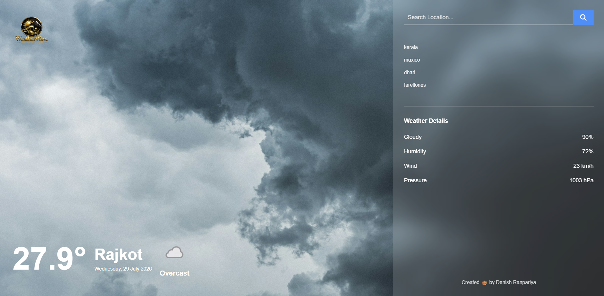

# 🌦️ WeatherWave - Weather App

A modern and responsive Weather App built using **HTML, CSS, and JavaScript**. It fetches live weather data using the **WeatherAPI** and changes the background image dynamically based on the current weather condition.

---

## 📸 Preview



---

## ✨ Features

- 🔍 Search weather by city name
- 🌡️ Live temperature display
- 📍 Shows city name
- 📅 Displays current date
- ☁️ Weather condition with icon
- 💧 Humidity
- 🌬️ Wind Speed
- ☁️ Cloud Percentage
- 📊 Air Pressure
- 🖼️ Dynamic background according to weather
- 📱 Responsive Design

---

## 🛠️ Technologies Used

- HTML5
- CSS3
- JavaScript (ES6)
- WeatherAPI
- Font Awesome

---

## 📂 Project Structure

```
Weather-App/
│
├── index.html
│
├── css/
│   └── style.css
│
├── javascript/
│   └── script.js
│
├── asset/
│   ├── logo.png
│   ├── sunny.jpg
│   ├── cloud.jpg
│   ├── rain.jpg
│   ├── thunder.jpg
│   ├── snow.jpg
│   ├── fog.jpg
│   └── sea.jpg
│
└── README.md
```

---

## 🚀 How to Run

1. Download or Clone this repository.

git clone https://github.com/deny0008/lab_work/tree/main/wether

2. Open the project folder.

3. Open **index.html** in your browser.

Or use **VS Code Live Server**.

---

## 🔑 API Used

This project uses **WeatherAPI**.

API Endpoint

```
https://api.weatherapi.com/v1/current.json
```

Get your free API Key from

https://www.weatherapi.com/

---

## 🌤️ Dynamic Backgrounds

The application automatically changes the background image according to the weather condition.

| Weather | Background |
|---------|------------|
| Sunny | ☀️ sunny.jpg |
| Cloudy | ☁️ cloud.jpg |
| Rain | 🌧️ rain.jpg |
| Thunder | ⛈️ thunder.jpg |
| Snow | ❄️ snow.jpg |
| Fog | 🌫️ fog.jpg |
| Default | 🌊 sea.jpg |

---

## 📌 Weather Information Displayed

- Temperature (°C)
- City Name
- Current Date
- Weather Condition
- Weather Icon
- Cloud Percentage
- Humidity
- Wind Speed
- Pressure

---

## 🎯 JavaScript Features

- Fetch API
- DOM Manipulation
- Event Listeners
- Dynamic Background Images
- API Integration
- Current Date Generator
- Error Handling
- Search Functionality

---

## 📷 Screenshot


## workimage


## logo


---

## 💻 Author

**Denish Ranpariya**

Created with ❤️ using HTML, CSS & JavaScript.


